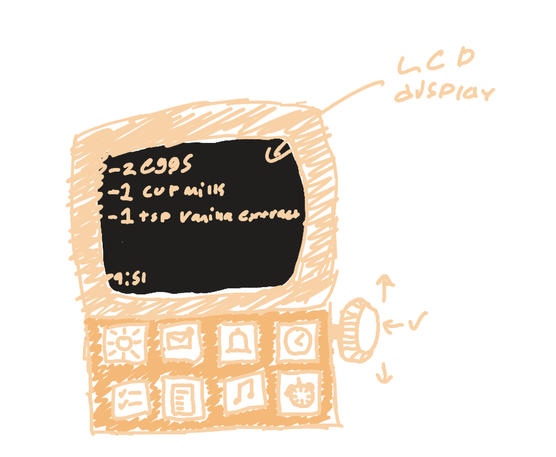
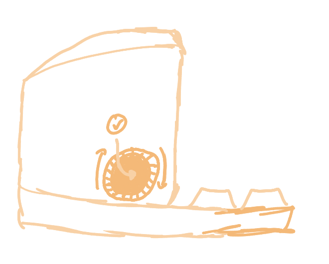
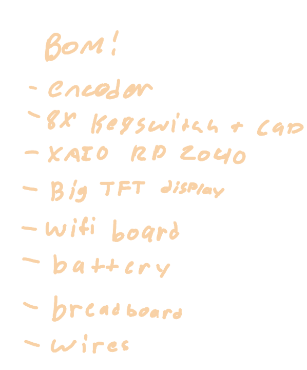

Total time: a lot idk 

July 11th - day 1 (1-2hrs)

Started sketching our idea, which was to make an Amazon Echo "frame" encasing a small LCD display, and implement better and more useful widgets than those available on the ad-filled e-waste that Amazon ships out for $150. This is what we came up with:

In addition to a sketch, we also wrote down a shortlist of hardware that we might need:

July 12th - day 2 

Got all the hardware and started working on the TFT LCD display. Tried arduino, micropython, and circuitpython and could not get the display to work at all. Ended up finally fixing the issue by watching a MicroPython guide recommended by some others who were also using the screen. This took basically the whole day, but ila stayed up until ~5am CADing the full model. This design was heavily inspired by retro/CRT displays (the print color might not be correct but we worked with what we had).

July 13th - day 3 

With the screen finally working and a 3D case in queue to print, we started work on the firmware. With so many delays, we had to drastically scale down the functionality of our device. We've decided to only include temperature, clock/timers, changing background, and text importing. We'll likely keep all 8 switches (for fidget purposes), but likely only have the top row actually function. We've also decided to omit the rotary encoder as a time-saving measure.