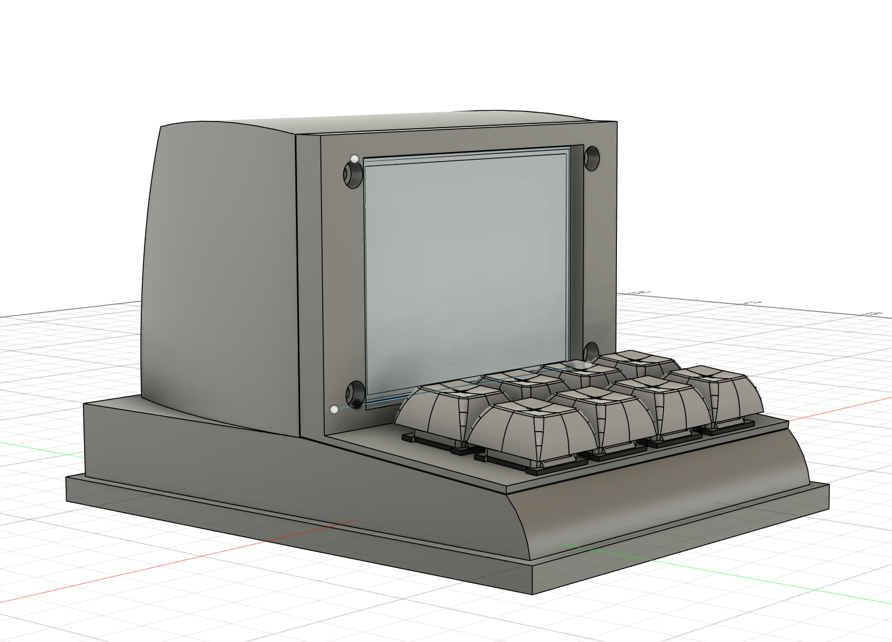
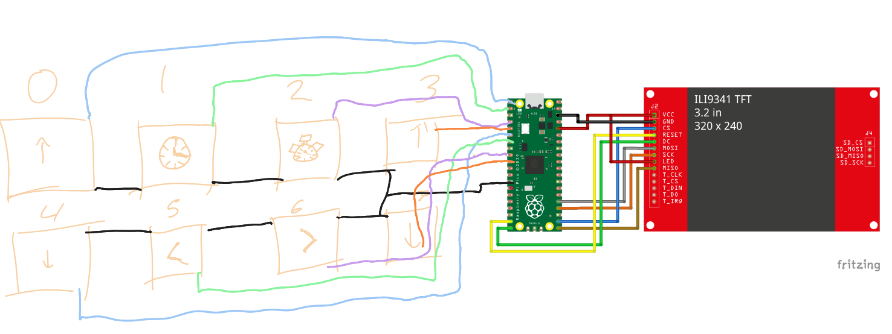

# CFrame

We created this project because the Amazon Echo absolutely sucks. It is filled with ads, doesn't integrate with any services not directly tied to Amazon, and has to be always plugged in due to its high power consumption. 

This screen aims to be a simplified version of an Amazon Echo with low power consumption while retaining decent functionality. It has the ability to display ambient temperature (though it becomes very inaccurate after a minute of being powered on), time, and start timers.

